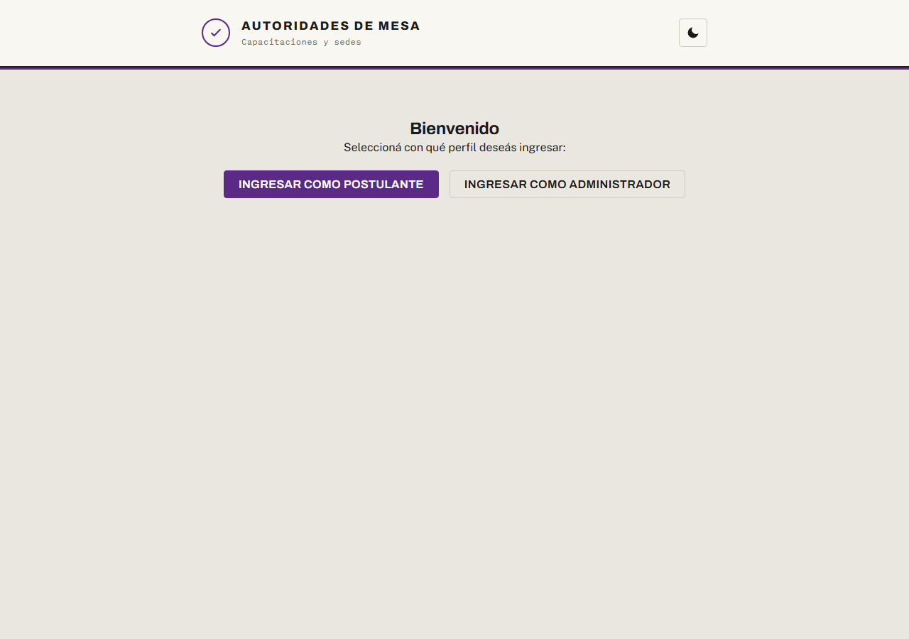
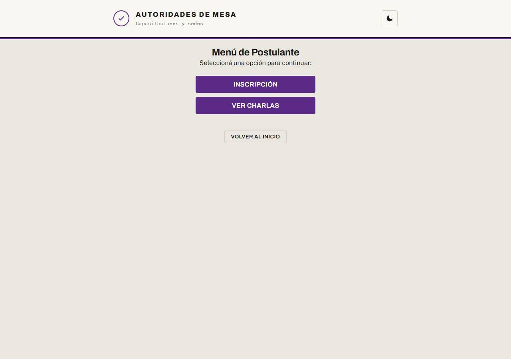
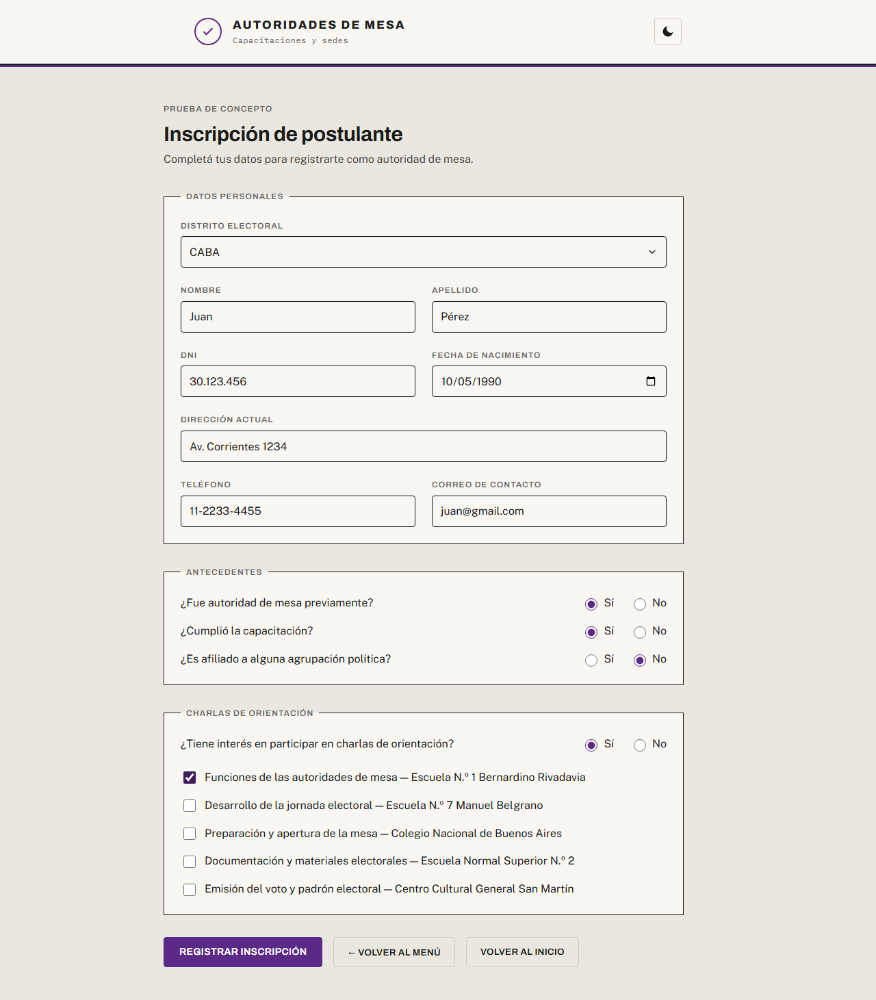
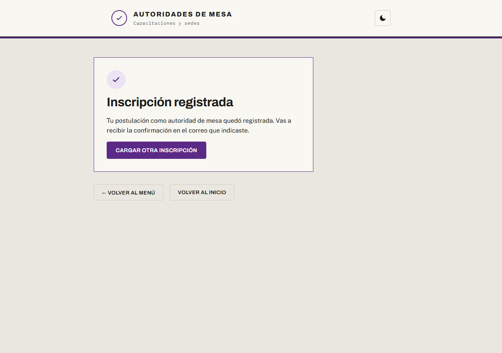
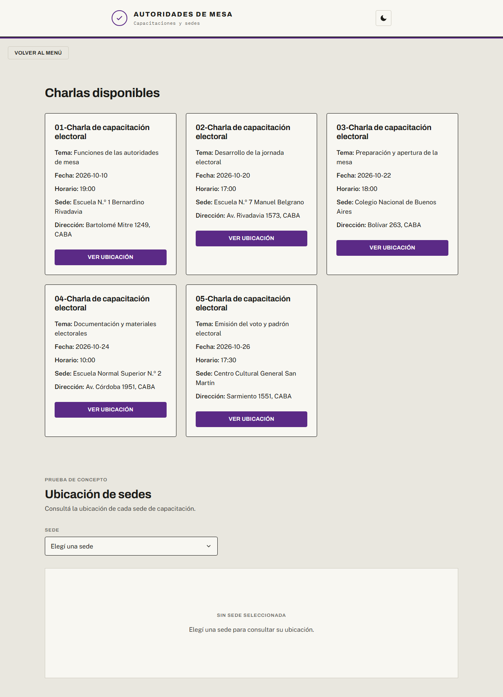
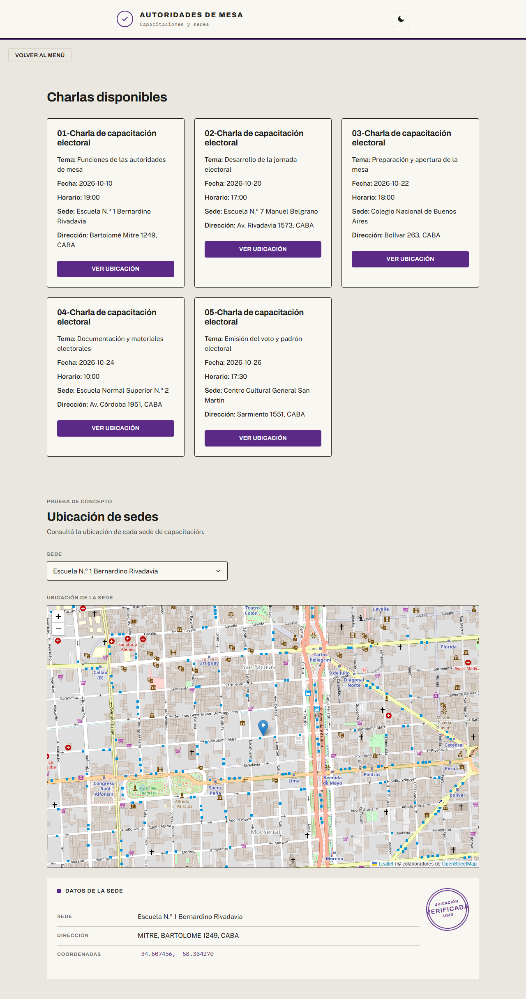
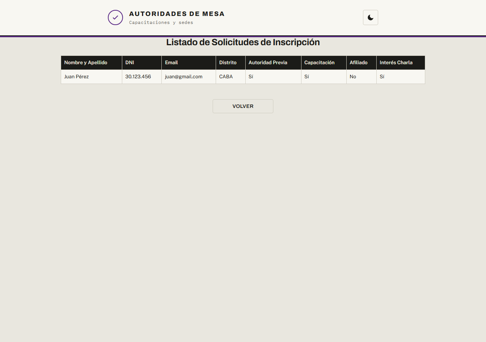
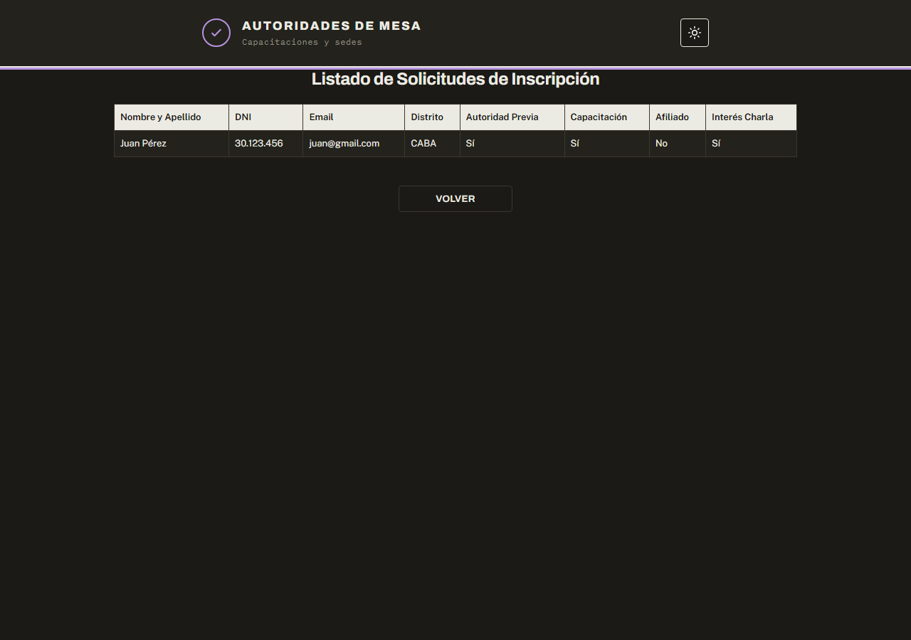

# hub-autoridades-de-mesa

Trabajo Práctico — Ingeniería de Software (UNGS) — **Grupo 03**
Sistema: **Portal para Autoridades de Mesa**

## Objetivo del TP

El proyecto busca facilitar la **convocatoria y registro de ciudadanos que se postulan para ser autoridades de mesa** en una elección, reemplazando un proceso manual por un portal web que centraliza la postulación, la evaluación de las solicitudes y la difusión de las charlas de capacitación.

**Objetivo de negocio:** agilizar la conformación del padrón de autoridades de mesa, ampliando el alcance de la convocatoria y reduciendo el trabajo administrativo de recepción y evaluación de postulaciones.

**Objetivo del sistema:** ofrecer un portal web donde:

- el **ciudadano** consulta las charlas de capacitación disponibles (con su sede y ubicación en el mapa) y registra su postulación como autoridad de mesa;
- el **administrador** gestiona las convocatorias y las charlas, y evalúa las solicitudes (aprobación/rechazo), con la correspondiente notificación al postulante;
- el sistema se integra con un **servicio externo de normalización de direcciones (USIG)** para ubicar las sedes en un mapa de forma dinámica a partir de su dirección.

## Este repositorio

Contiene la **Prueba de Concepto (prototipo funcional)** de la segunda entrega. Desde una pantalla de inicio se elige el perfil de ingreso:

- el **usuario** puede **inscribirse como postulante** (formulario con validación de datos y persistencia) y **consultar las charlas** de capacitación, visualizando la **ubicación de cada sede en el mapa** mediante el consumo en vivo de la **API de USIG**;
- el **administrador** accede a un panel que **lista las postulaciones** registradas.

## Capturas del prototipo

Recorrido del flujo completo, de punta a punta:

### 1. Inicio — selección de perfil



### 2. Menú de usuario



### 3. Inscripción de postulante



### 4. Confirmación de la inscripción



### 5. Consulta de charlas



### 6. Ubicación de la sede en el mapa (USIG)



### 7. Panel de administrador — listado de postulaciones



### 8. Modo oscuro



## Cómo ejecutarlo

**Requisitos:** Node.js **20.19+ o 22.12+** y npm (viene con Node). No requiere claves ni credenciales.

1. Instalar las dependencias (un solo comando, desde `package.json`):

   ```bash
   npm install
   ```

2. Iniciar el entorno de desarrollo:

   ```bash
   npm run dev
   ```

   Vite imprime la URL local en la consola (por defecto `http://localhost:5173`).

Para generar la versión de producción y previsualizarla:

```bash
npm run build
npm run preview
```

## Stack tecnológico

- **React** (v19) como librería de UI, con componentes para las distintas vistas del portal.
- **Vite** como entorno de desarrollo y empaquetado (servidor de desarrollo y build de producción).
- **Leaflet** + **react-leaflet** para renderizar el mapa interactivo sobre mosaicos de **OpenStreetMap** (gratuito y sin credenciales).
- **API de USIG** (servicio externo de normalización de direcciones) para obtener dinámicamente las coordenadas de una sede a partir de su dirección.
- **JavaScript (ES Modules)** como lenguaje.
- **Navegación por perfiles** (usuario / administrador) resuelta con vistas por estado en React, sin dependencias de routing.
- **Persistencia**: almacenamiento del navegador (`localStorage`) para las postulaciones, con las charlas y sedes precargadas; no requiere servidor ni claves para ejecutarse.

## Arquitectura

El proyecto sigue una **arquitectura hexagonal (puertos y adaptadores)**: el dominio queda aislado del exterior y la regla de dependencias apunta hacia adentro (la UI y los adaptadores dependen del núcleo, nunca al revés). Los puertos se usan únicamente en las dos costuras con variación real esperada (el servicio externo (USIG) y la persistencia), evitando abstracciones innecesarias en el resto.

```
src/
├── domain/                        → NÚCLEO: dominio puro, sin dependencias externas
│   ├── model/                     → entidades y datos de dominio (Charla, Sede, Ubicacion,
│   │                                Postulacion, Solicitud, Persona, DistritoElectoral, menús)
│   └── services/                  → reglas de negocio (validación de la postulación)
├── application/                   → orquestación
│   ├── usecases/                  → casos de uso (consultar charlas, ubicar sede, registrar postulación)
│   └── ports/                     → PUERTOS (contrato de geocodificación)
├── infrastructure/
│   └── adapters/                  → ADAPTADORES "driven" (implementan los puertos)
│       ├── usig/                  → adaptador del servicio externo USIG
│       └── persistence/           → adaptadores localStorage / datos precargados
└── ui/                            → ADAPTADOR "driving" (React)
    ├── components/                → componentes reutilizables (MapaSede, Campo, RadioSiNo)
    ├── pages/                     → vistas (inicio, menús, inscripción, charlas, mapa, admin)
    ├── hooks/                     → useTema (modo claro/oscuro)
    ├── utils/                     → utilidades de UI (máscaras de formato)
    └── styles/                    → estilos (tokens y hojas por vista)
```

El punto de entrada (`src/main.jsx`) actúa como *composition root*: instancia los adaptadores concretos y los inyecta en los casos de uso.
